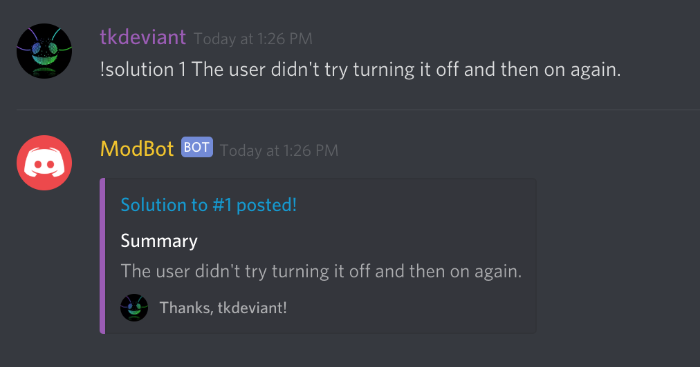
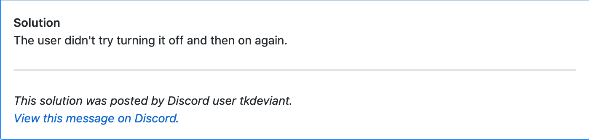

# GithubSolution Cog
A cog for [Red-DiscordBot](https://red-discordbot.readthedocs.io/en/v3-develop/)
that cross-posts solutions for GitHub issues from Discord.

## Authentication
GithubSolution requires a personal access token for authentication. 
Please use [this guide](https://help.github.com/articles/creating-a-personal-access-token-for-the-command-line/) to 
obtain one.

The personal access token needs **repo** scope.

## Configuration
All configuration is on a per-guild (server) basis.

| field            | command                                                               | description                                                                       | permissions           |
|------------------|-----------------------------------------------------------------------|-----------------------------------------------------------------------------------|-----------------------|
| github_project   | !setproject namespace/project <br/>  `!setproject tlkamp/githubsolutioncog` | The project GithubSolution checks for issues.                                     | Guild (server) Admin. |
| github_token_var | !settokenvar MYVARIABLE <br/>  `!settokenvar GHTOKEN`                       | The environment variable GithubSolution will pull the personal access token from. | Bot owner.            |

## Usage
To post a solution simply give the command:

```
# Syntax
!solution <issue number> <summary>

# Example
!solution 123 The user did not try turning it off and then on again.
```




